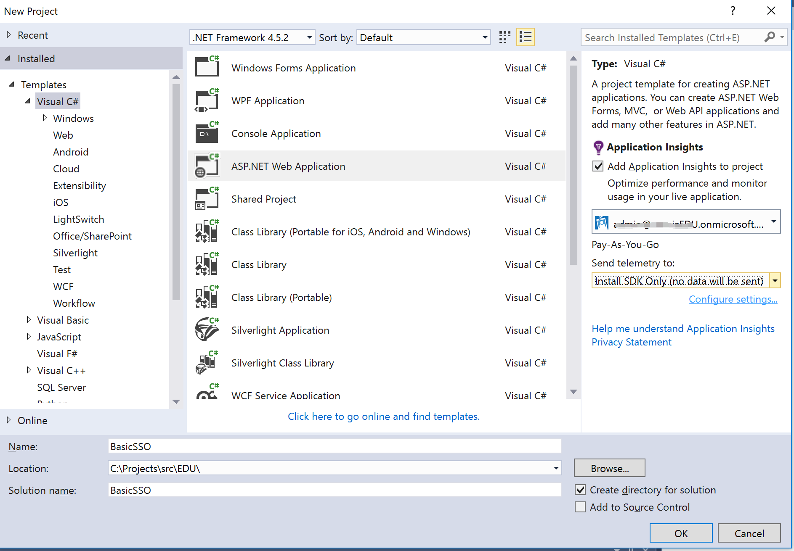
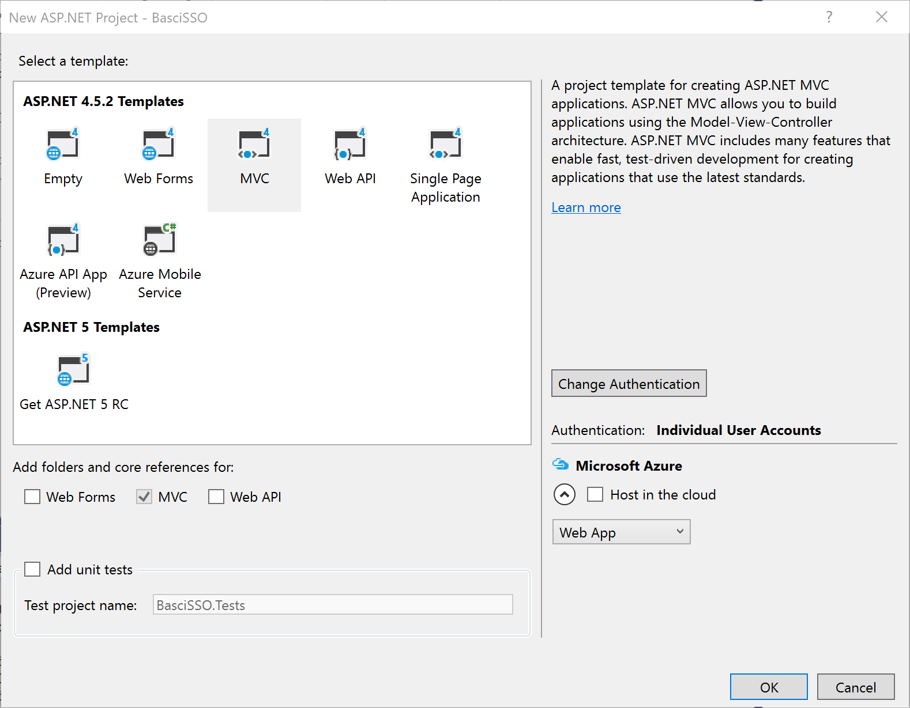
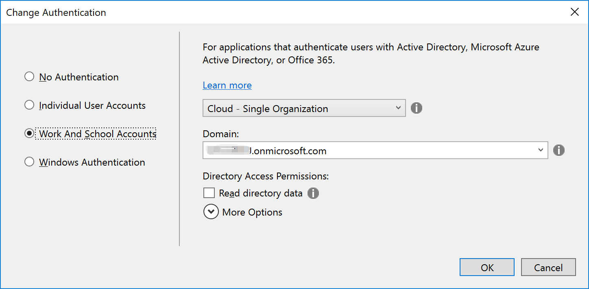
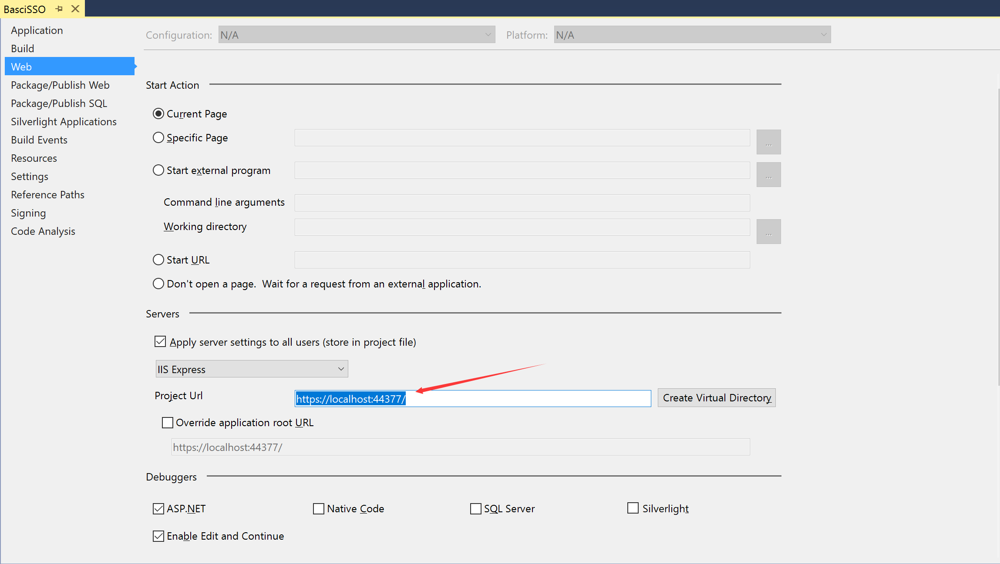
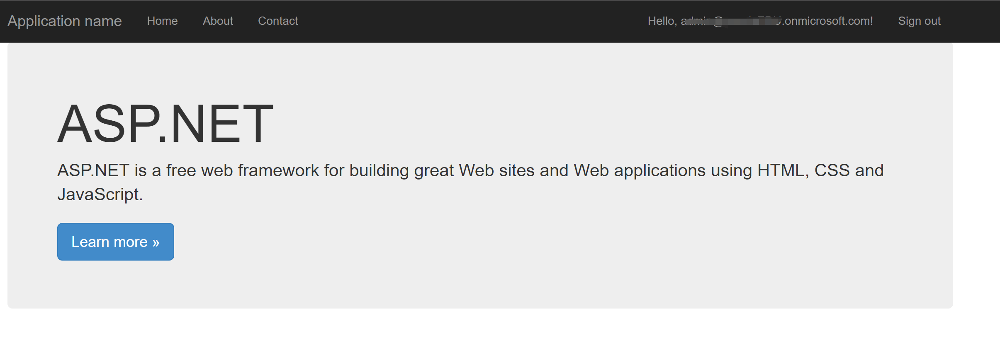

# Basic SSO - .NET version

In this sample we show you how to integrate Azure Active Directory(Azure AD) to provide secure sign in and authorization. 

The code in the following sections is part of the full featured .NET app and presented as a new project for clarity and separation of functionality.

**Table of contents**
* [Register the application in Azure Active Directory](#register-the-application-in-azure-active-directory)
* [Build and debug locally](#build-and-debug-locally)


## Register the application in Azure Active Directory

1. Sign in to the Azure portal: [https://portal.azure.com/](https://portal.azure.com/).

2. Choose your Azure AD tenant by selecting your account in the top right corner of the page.

3. Click **Azure Active Directory** -> **App registrations** -> **+Add**.

4. Input a **Name**, and select **Web app / API** as **Application Type**.

   Input **Sign-on URL**: https://localhost:44377/

   

   Click **Create**.

5. Once completed, the app will show in the list.

   

6. Click it to view its details. 

   

7. Click **All settings**, if the setting window did not show.

     

     Copy aside **Application ID**, then Click **Save**.

   * Click **Reply URLs**, add the following URL into it.

     [https://localhost:44377/](https://localhost:44377/)

   * Click **Required permissions**. Add the following permissions:

     | API                            | Application Permissions | Delegated Permissions         |
     | ------------------------------ | ----------------------- | ----------------------------- |
     | Windows Azure Active Directory |                         | Sign in and read user profile |

     

   * Click **Keys**, then add a new key

     

     Click **Save**, then copy aside the **VALUE** of the key. 

   Close the Settings window.


## Build and debug locally

This project can be opened with the edition of Visual Studio 2015 you already have, or download and install the Community edition to run, build and/or develop this application locally.

- [Visual Studio 2015 Community](https://go.microsoft.com/fwlink/?LinkId=691978&clcid=0x409)

Debug the **EDUGraphAPI.Web**:

1. Open Visual Studio 2015 as administrator, first we will create an empty project.

2. Click **File**->**New**->**Project**, select **ASP.NET Web Application**, create a web project named **BasicSSO**.

   

3. Select **MVC** template. 

   

4. Change authentication as following.

   

   ​

5. After created project successfully, select **Tools** -> **Nuget Package Manager** -> **Package Manager Console**.

6. Install **EntityFramework**, **EntityFramework.SqlServerCompact**  and  **Microsoft.IdentityModel.Clients.ActiveDirectory**.

   ~~~xml
   Install-Package EntityFramework
   Install-Package EntityFramework.SqlServerCompact
   Install-Package Microsoft.IdentityModel.Clients.ActiveDirectory
   ~~~

7. On the **Models** folder, add two files named **AdalTokenCache.cs** and **ApplicationDbContext.cs** to store user cache.

8. Open **AdalTokenCache.cs**  file, delete all code and copy the following code to paste.

       using Microsoft.IdentityModel.Clients.ActiveDirectory;
              using System;
              using System.Linq;
              using System.Web.Security;
              
              namespace BasicSSO.Models
              {
                  public class AdalTokenCache : TokenCache
                  {
                      private static readonly string MachinKeyProtectPurpose = "ADALCache";
              
                      private string userId;
              
                      public AdalTokenCache(string signedInUserId)
                      {
                          this.userId = signedInUserId;
                          this.AfterAccess = AfterAccessNotification;
                          this.BeforeAccess = BeforeAccessNotification;
              
                          GetCacheAndDeserialize();
                      }
              
                      public override void Clear()
                      {
                          base.Clear();
                          ClearUserTokenCache(userId);
                      }
              
                      void BeforeAccessNotification(TokenCacheNotificationArgs args)
                      {
                          GetCacheAndDeserialize();
                      }
              
                      void AfterAccessNotification(TokenCacheNotificationArgs args)
                      {
                          if (this.HasStateChanged)
                          {
                              SerializeAndUpdateCache();
                              this.HasStateChanged = false;
                          }
                      }


                      private void GetCacheAndDeserialize()
                      {
                          var cacheBits = GetUserTokenCache(userId);
                          if (cacheBits != null)
                          {
                              try
                              {
                                  var data = MachineKey.Unprotect(cacheBits, MachinKeyProtectPurpose);
                                  this.Deserialize(data);
                              }
                              catch { }
                          }
                      }
              
                      private void SerializeAndUpdateCache()
                      {
                          var cacheBits = MachineKey.Protect(this.Serialize(), MachinKeyProtectPurpose);
                          UpdateUserTokenCache(userId, cacheBits);
                      }


                      private byte[] GetUserTokenCache(string userId)
                      {
                          using (var db = new ApplicationDbContext())
                          {
                              var cache = GetUserTokenCache(db, userId);
                              return cache != null ? cache.cacheBits : null;
                          }
                      }
              
                      private void UpdateUserTokenCache(string userId, byte[] cacheBits)
                      {
                          using (var db = new ApplicationDbContext())
                          {
                              var cache = GetUserTokenCache(db, userId);
                              if (cache == null)
                              {
                                  cache = new UserTokenCache { webUserUniqueId = userId };
                                  db.UserTokenCacheList.Add(cache);
                              }
              
                              cache.cacheBits = cacheBits;
                              cache.LastWrite = DateTime.UtcNow;
              
                              db.SaveChanges();
                          }
                      }
              
                      private UserTokenCache GetUserTokenCache(ApplicationDbContext db, string userId)
                      {
                          return db.UserTokenCacheList
                                 .OrderByDescending(i => i.LastWrite)
                                 .FirstOrDefault(c => c.webUserUniqueId == userId);
                      }
              
                      private void ClearUserTokenCache(string userId)
                      {
                          using (var db = new ApplicationDbContext())
                          {
                              var cacheEntries = db.UserTokenCacheList
                                  .Where(c => c.webUserUniqueId == userId)
                                  .ToArray();
                              db.UserTokenCacheList.RemoveRange(cacheEntries);
                              db.SaveChanges();
                          }
                      }
              
                      public static void ClearUserTokenCache()
                      {
                          using (var db = new ApplicationDbContext())
                          {
                              var cacheEntries = db.UserTokenCacheList
                                  .ToArray();
                              db.UserTokenCacheList.RemoveRange(cacheEntries);
                              db.SaveChanges();
                          }
                      }
                  }
              }


9. Open **ApplicationDbContext.cs**  file,  delete all code and copy the following code to paste.

       using System;
              using System.ComponentModel.DataAnnotations;
              using System.Data.Entity;
              
              namespace BasicSSO.Models
              {
                  public class ApplicationDbContext : DbContext
                  {
                      public ApplicationDbContext()
                          : base("DefaultConnection")
                      {
                      }
              
                      public DbSet<UserTokenCache> UserTokenCacheList { get; set; }
                  }
              
                  public class UserTokenCache
                  {
                      [Key]
                      public int UserTokenCacheId { get; set; }
              
                      public string webUserUniqueId { get; set; }
              
                      [MaxLength]
                      public byte[] cacheBits { get; set; }
              
                      public DateTime LastWrite { get; set; }
                  }
              }


10. Open **Web.config** file, add the following connection strings to **configuration**

  ```xml
   <connectionStrings>
     <add name="DefaultConnection" connectionString="Data Source=|DataDirectory|BasicSSO.sdf" providerName="System.Data.SqlServerCe.4.0" />
   </connectionStrings>
  ```

11. Find **appSetings** section, replace the **appSettings** using the following code.  

    ```xml
      <appSettings>
        <add key="webpages:Version" value="3.0.0.0" />
        <add key="webpages:Enabled" value="false" />
        <add key="ClientValidationEnabled" value="true" />
        <add key="UnobtrusiveJavaScriptEnabled" value="true" />

        <add key="ida:AADInstance" value="https://login.microsoftonline.com/" />
        <add key="ida:ClientId" value="INSERT YOUR CLIENT ID HERE" />
        <add key="ida:ClientSecret" value="INSERT YOUR CLIENT SECRET HERE" />
      </appSettings>
    ```
    - **ida:ClientId**: use the Client Id of the app registration you created earlier.

    - **ida:ClientSecret**: use the Key value of the app registration you created earlier.

      ​

12. Open **App_Start** ->  **Startup.Auth.cs**, delete all code and copy the following code to paste

    ```
    using System;
    using System.Configuration;
    using System.IdentityModel.Claims;
    using System.Threading.Tasks;
    using System.Web;
    using Microsoft.Owin.Security;
    using Microsoft.Owin.Security.Cookies;
    using Microsoft.Owin.Security.OpenIdConnect;
    using Microsoft.IdentityModel.Clients.ActiveDirectory;
    using Owin;
    using BasicSSO.Models;

    namespace BasicSSO
    {
        public partial class Startup
        {
            private static string clientId = ConfigurationManager.AppSettings["ida:ClientId"];
            private static string clientSecret = ConfigurationManager.AppSettings["ida:ClientSecret"];
            public static readonly string Authority = ConfigurationManager.AppSettings["ida:AADInstance"] + "common/";
            public static string AADGraph = "https://graph.windows.net";

            public void ConfigureAuth(IAppBuilder app)
            {
                app.SetDefaultSignInAsAuthenticationType(CookieAuthenticationDefaults.AuthenticationType);

                app.UseCookieAuthentication(new CookieAuthenticationOptions { });

                app.UseOpenIdConnectAuthentication(
                    new OpenIdConnectAuthenticationOptions
                    {
                        Caption = "Microsoft Work or school account",
                        ClientId = clientId,
                        Authority = Authority,
                        TokenValidationParameters = new System.IdentityModel.Tokens.TokenValidationParameters
                        {
                            // instead of using the default validation (validating against a single issuer value, as we do in line of business apps), 
                            // we inject our own multitenant validation logic
                            ValidateIssuer = false,
                        },
                        Notifications = new OpenIdConnectAuthenticationNotifications()
                        {
                            RedirectToIdentityProvider = (context) =>
                            {
                                // This ensures that the address used for sign in and sign out is picked up dynamically from the request
                                // this allows you to deploy your app (to Azure Web Sites, for example)without having to change settings
                                // Remember that the base URL of the address used here must be provisioned in Azure AD beforehand.
                                string appBaseUrl = context.Request.Scheme + "://" + context.Request.Host + context.Request.PathBase;
                                context.ProtocolMessage.RedirectUri = appBaseUrl + "/";
                                context.ProtocolMessage.PostLogoutRedirectUri = appBaseUrl;
                                return Task.FromResult(0);
                            },
                            AuthorizationCodeReceived = async (context) =>
                            {
                                var identity = context.AuthenticationTicket.Identity;

                                // Get token with authorization code
                                Uri redirectUri = new Uri(HttpContext.Current.Request.Url.GetLeftPart(UriPartial.Path));
                                ClientCredential credential = new ClientCredential(clientId, clientSecret);
                                string signedInUserID = context.AuthenticationTicket.Identity.FindFirst(ClaimTypes.NameIdentifier).Value;
                                AuthenticationContext authContext = new AuthenticationContext(Authority, new AdalTokenCache(signedInUserID));
                                AuthenticationResult authResult = await authContext.AcquireTokenByAuthorizationCodeAsync(context.Code,
                                    redirectUri, credential, AADGraph);
                            },
                            AuthenticationFailed = (context) =>
                            {
                                var redirectUrl = "/Error?message=" + Uri.EscapeDataString(context.Exception.Message);
                                context.OwinContext.Response.Redirect(redirectUrl);
                                context.HandleResponse(); // Suppress the exception
                                return Task.FromResult(0);
                            }
                        }
                    });
            }
        }
    }
    ```
    ​

13. On **Controllers** folder, create new controller named **ErrorController**.

14. Open **ErrorController** file, delete all code and copy the following code to paste
```
using System.Web.Mvc;
        
namespace BasicSSO.Controllers
    {
        public class ErrorController : Controller
        {
            //
            // GET: /Error/Index
            public ActionResult Index(string message)
            {
                return View((object)message);
            }
        }
    }
```

15. On **Views** -> **Error**, create new view named **Index** 

16. Open **Index**, delete all code and copy the following code to paste
```
@model string
@{
    ViewBag.Title = "Error";
}
    <h2 class="text-danger">Error</h2>
    <h3 class="text-danger">@Model</h3>
```

17. Select Project file, click right key and select **Properties**, change Project Url to **https://localhost:44377/**

    

18. Press F5, hello world page is presented after login successfully. 

    


**Copyright (c) 2017 Microsoft. All rights reserved.**
