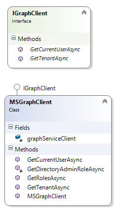

# EDUGraphAPI - Office 365 Education Code Sample

In this sample we show you how to integrate with school roles/roster data as well as O365 services available via the Graph API. 

School data is kept in sync in O365 Education tenants by [Microsoft School Data Sync](http://sds.microsoft.com).  

**Table of contents**
* [Sample Goals](#sample-goals)
* [Prerequisites](#prerequisites)
* [Register the application in Azure Active Directory](#register-the-application-in-azure-active-directory)
* [Build and debug locally](#build-and-debug-locally)
* [Deploy the sample to Azure](#deploy-the-sample-to-azure)
* [Understand the code](#understand-the-code)
* [[Optional] Build and debug the WebJob locally](#optional-build-and-debug-the-webjob-locally)
* [Questions and comments](#questions-and-comments)
* [Contributing](#contributing)

## Sample Goals

The sample demonstrates:

* Calling Graph APIs, including:

  * [Microsoft Azure Active Directory Graph API](https://www.nuget.org/packages/Microsoft.Azure.ActiveDirectory.GraphClient/)
  * [Microsoft Graph API](https://www.nuget.org/packages/Microsoft.Graph/)

* Linking locally-managed user accounts and Office 365 (Azure Active Directory) user accounts. 

  After linking accounts, users can use either local or Office 365 accounts to log into the sample web site and use it.

* Getting schools, sections, teachers, and students from Office 365 Education:

  * [Office 365 Schools REST API reference](https://msdn.microsoft.com/office/office365/api/school-rest-operations)
  * A [Differential Query](https://msdn.microsoft.com/en-us/library/azure/ad/graph/howto/azure-ad-graph-api-differential-query) is used to sync data that is cached in a local database by the SyncData Web Job.

EDUGraphAPI is based on ASP.NET MVC and [ASP.NET Identity](https://www.asp.net/identity) is also used in this project.

## Prerequisites

**Deploying and running this sample requires**:
* An Azure subscription with permissions to register a new application, and deploy the web app.
* An O365 Education tenant with Microsoft School Data Sync enabled
    * One of the following browsers: Edge, Internet Explorer 9, Safari 5.0.6, Firefox 5, Chrome 13, or a later version of one of these browsers.
      Additionally: Developing/running this sample locally requires the following:  
    * Visual Studio 2015 (any edition), [Visual Studio 2015 Community](https://go.microsoft.com/fwlink/?LinkId=691978&clcid=0x409) is available for free.
    * Familiarity with C#, .NET Web applications, JavaScript programming and web services.

## Register the application in Azure Active Directory

1. Sign into the new azure portal: [https://portal.azure.com/](https://portal.azure.com/).

2. Choose your Azure AD tenant by selecting your account in the top right corner of the page:

   

3. Click **Azure Active Directory** -> **App registrations** -> **+Add**.

   

4. Input a **Name**, and select **Web app / API** as **Application Type**.

   Input **Sign-on URL**: https://localhost:44311/

   

   Click **Create**.

5. Once completed, the app will show in the list.

   

6. Click it to view its details. 

   

7. Click **All settings**, if the setting window did not show.

   * Click **Properties**, then set **Multi-tenanted** to **Yes**.

     

     Copy aside **Application ID**, then Click **Save**.

   * Click **Required permissions**. Add the following permissions:

     | API                            | Application Permissions                  | Delegated Permissions                    |
     | ------------------------------ | ---------------------------------------- | ---------------------------------------- |
     | Microsoft Graph                | Read all users' full profiles<br> Read directory data | Read directory data<br>Access directory as the signed in user<br>Sign users in |
     | Windows Azure Active Directory | Read directory data                      | Sign in and read user profile<br>Read and write directory data |

     

   * Click **Keys**, then add a new key:

     

     Click **Save**, then copy aside the **VALUE** of the key. 

   Close the Settings window.

8. Click **Manifest**.

   

   Insert the following JSON to the array of **keyCredentials**.

   ~~~json
       {
         "customKeyIdentifier": "nNWUyxhgK5zcg7pPj8UFo1xFM9Y=",
         "keyId": "fec5af6a-1cc8-45ec-829f-95999e623b2d",
         "type": "AsymmetricX509Cert",
         "usage": "Verify",
         "value": "MIIDIzCCAg+gAwIBAgIQUWcl+kIoiZxPK2tT8v05WzAJBgUrDgMCHQUAMCQxIjAgBgNVBAMTGUVkdUdyYXBoQVBJIEFwcCBPbmx5IENlcnQwHhcNMTYxMDMxMTYwMDAwWhcNMzYxMDMwMTYwMDAwWjAkMSIwIAYDVQQDExlFZHVHcmFwaEFQSSBBcHAgT25seSBDZXJ0MIIBIjANBgkqhkiG9w0BAQEFAAOCAQ8AMIIBCgKCAQEAwND0Wclbty/5UYwsrjAvSFaw8JOi33lXP1QI4qecOH4HXvrhz4L5ZN8thG6L/nSIcocuELNbDfJhLehBzxKwtvq9tO0o3MpFK0aloQS5JmoAstMns427osG8DpfnaqwiFyMv558fUHSEkx8GSU/IQgZ6IoSLahTSGCy0LRFHKIyZ6Xo0z9zYN07eQO53obakNlF6YzUg+2v6jLmKnmSXbog+46F9yVvTK2/4MLdPy7lKO2lycec+mljlBWJF4shLacaVrdtQZtanY0zN+XlM48mUVSToNz18tGX/cW9PT5WqIO/O5liEnz9O5u4NTBUUYDqiSuxA4yHV63A+zxhwPwIDAQABo1kwVzBVBgNVHQEETjBMgBAUkYVZ6pBIdTnoV4pmTRzwoSYwJDEiMCAGA1UEAxMZRWR1R3JhcGhBUEkgQXBwIE9ubHkgQ2VydIIQUWcl+kIoiZxPK2tT8v05WzAJBgUrDgMCHQUAA4IBAQBwRDrFpLRYGFARs20Ez+sK6ACrtFbVC5tAnFxr97FWTbixXFm1GPC/pmSnYsiRtiLMliX1+QmTIT80OFk2rfnv3EjY2uCF0XWXH7oRonUFpScA2rQ0geEPRVDXHQ9TJcdEX6+QD6/hAFyANUkWb9uHT1srIxUHerwPCmprOfSCqLVkYXZgvnvWC9XeJP4KriftiqNkfr2FIjqvWrkUMn7iHBHRMW42gfsHoX9LmRLjoqnm1YEyS/t2tibL3FAsJvWv0T03JDCwePF13oItzV0lp0jJDz+xahz8aG3gkacmjzliBeXWWEo9VfxOGLsHjonj3lRSsQLfOn5k3e6lxsJG"
       }
   ~~~

   

   Click **Save**.

   > Note: this step configures the certification used by a Web Job. Check **Application Authentication Flow** section for more details.

## Build and debug locally

This project can be opened with the edition of Visual Studio 2015 you already have, or download and install the Community edition to run, build and/or develop this application locally.

- [Visual Studio 2015 Community](https://go.microsoft.com/fwlink/?LinkId=691978&clcid=0x409)

Debug the **EDUGraphAPI.Web**:

1. Configure **appSettings** in the **Web.config**. 

   

   - **ida:ClientId**: use the Client Id of the app registration you created earlier.
   - **ida:ClientSecret**: use the Key value of the app registration you created earlier.
   - **SourceCodeRepositoryURL**: use the repository URL of your fork.


2. Set **EDUGraphAPI.Web** as StartUp project, and press F5. 

## Deploy the sample to Azure

**GitHub Authorization**

1. Generate Token

   - Open https://github.com/settings/tokens in your web browser.
   - Sign into your GitHub account where you forked this repository.
   - Click **Generate Token**
   - Enter a value in the **Token description** text box
   - Select the following s (your selections should match the screenshot below):
        - repo (all) -> repo:status, repo_deployment, public_repo
        - admin:repo_hook -> read:repo_hook

   

   - Click **Generate token**
   - Copy the token

2. Add the GitHub Token to Azure in the Azure Resource Explorer

   - Open https://resources.azure.com/providers/Microsoft.Web/sourcecontrols/GitHub in your web browser.
   - Log in with your Azure account.
   - Selected the correct Azure subscription.
   - Select **Read/Write** mode.
   - Click **Edit**.
   - Paste the token into the **token parameter**.

   

   - Click **PUT**

**Deploy the Azure Components from GitHub**

1. Check to ensure that the build is passing VSTS Build.

2. Fork this repository to your GitHub account.

3. Click the Deploy to Azure Button:

   [](https://portal.azure.com/#create/Microsoft.Template/uri/https%3A%2F%2Fraw.githubusercontent.com%2FOfficeDev%2FO365-EDU-AspNetMVC-Samples%2Fmaster%2Fazuredeploy.json)

4. Fill in the values in the deployment page and select the **I agree to the terms and conditions stated above** checkbox.

   

   * **Resource group**: we suggest you to Create a new group.

   * **Site Name**: please input a name. Like EDUGraphAPICanviz or EDUGraphAPI993.

     > Note: If the name you input is taken, you will get some validation errors:
     >
     > 
     >
     > Click it you will get more details, like storage account is already in other resource group/subscription.
     >
     > In this case, please use another name.

   * **Source Code Repository URL**: replace <YOUR REPOSITORY> with the repository name of your fork.

   * **Source Code Manual Integration**: choose **false**, since you are deploying from your own fork.

   * **Client Id**: use the Client Id of the app registration you created earlier.

   * **Client Secret**: use the Key value of the app registration you created earlier.

   * Check **I agree to the terms and conditions stated above**.

5. Click **Purchase**.

**Add REPLY URL to the app registration**

1. After the deployment, open the resource group:

   

2. Click the web app.

   

   Copy the URL aside and change the schema to **https**. This is the replay URL and will be used in next step.

3. Navigate to the app registration in the new azure portal, then open the setting windows.

   Add the reply URL:

   

   > Note: to debug the sample locally, make sure that https://localhost:44311/ is in the reply URLs.

4. Click **SAVE**.

## Understand the code

### Introduction

**Solution Component Diagram**


The top layer of the solution contains a web application and a WebJob console application.

The middle layer contains two class library projects. 

The bottom layers contains the three data sources.

**EDUGraphAPI.Web**

This web application is based on an ASP.NET MVC project template with the **Individual User Accounts** option selected. 


The following files were created by the MVC template, and only minor changes were made:

1. **/App_Start/Startup.Auth.Identity.cs** (The original name is Startup.Auth.cs)
2. **/Controllers/AccountController.cs**

This sample project uses **[ASP.NET Identity](https://www.asp.net/identity)** and **[Owin](https://docs.microsoft.com/en-us/aspnet/core/fundamentals/owin)**. These two technologies make different methods of authentication coexist easily. Familiarity with these components, in addition to ASP.NET MVC, is essential to understanding this sample.

Below are important class files used in this web project:

| File                              | Description                              |
| --------------------------------- | ---------------------------------------- |
| /App_Start/Startup.Auth.AAD.cs    | Integrates with Azure Active Directory authentication |
| /Controllers/AdminController.cs   | Contains the administrative actions: <br>admin consent, manage linked accounts and install the app. |
| /Controllers/LinkController.cs    | Contains the actions to link AD and local user accounts |
| /Controllers/SchoolsController.cs | Contains the actions to present education data |

This web application is a **multi-tenant app**. In the AAD, we enabled the option:


Users from any Azure Active Directory tenant can access this app. As this app uses some application permissions, an administrator of the tenant should sign up (consent) first. Otherwise, users would be an error:


For more information, see [Build a multi-tenant SaaS web application using Azure AD & OpenID Connect](https://azure.microsoft.com/en-us/resources/samples/active-directory-dotnet-webapp-multitenant-openidconnect/).

**EDUGraphAPI.SyncData**

This is the WebJob used to sync user data. In the **Functions.SyncUsersAsync** method, **UserSyncService** from EDUGraphAPI.Common project is used.

The project was created to demonstrate differential query. Please check [Differential query](#differential-query) section for more details.

**EDUGraphAPI.Common**

The class library project is used both the **EDUGraphAPI.Web** and **EDUGraphAPI.SyncData**. 

The table below shows the folders in the project:

| Folder             | Description                              |
| ------------------ | ---------------------------------------- |
| /Data              | Contains ApplicationDbContext and entity classes |
| /DataSync          | Contains the UserSyncSerextensionsvice class which is used by the EDUGraphAPI.SyncData WebJob |
| /DifferentialQuery | Contains the DifferentialQueryService class which is used to send differential query and parse the result. |
| /Extensions        | Contains lots of extension methods which simplify coding the make code easy to read |
| /Utils             | Contains the wide used class AuthenticationHelper.cs |

**Microsoft.Education**

This project encapsulates the **[Schools REST API](https://msdn.microsoft.com/en-us/office/office365/api/school-rest-operations)** client. The core class in this project is **EducationServiceClient**.

### Data Access and Data Models

ASP.NET Identity uses [Entity Framework Code First](https://msdn.microsoft.com/en-us/library/jj193542(v=vs.113).aspx) to implement all of its persistence mechanisms. Package [Microsoft.AspNet.Identity.EntityFramework](https://www.nuget.org/packages/Microsoft.AspNet.Identity.EntityFramework/) is consumed for this. 

In this sample, **ApplicationDbContext** is created for access to the database. It inherited from **IdentityDbContext** which is defined in the NuGet package mentioned above.

Below are the important Data Models (and their important properties) that used in this sample:

**ApplicationUsers**

Inherited from **IdentityUser**. 

| Property      | Description                              |
| ------------- | ---------------------------------------- |
| Organization  | The tenant of the user. For local unlinked user, its value is null |
| O365UserId    | Used to link with an Office 365 account  |
| O365Email     | The Email of the linked Office 365 account |
| JobTitle      | Used for demonstrating differential query |
| Department    | Used for demonstrating differential query |
| Mobile        | Used for demonstrating differential query |
| FavoriteColor | Used for demonstrating local data        |

**Organizations**

A row in this table represents a tenant in AAD.

| Property         | Description                          |
| ---------------- | ------------------------------------ |
| TenantId         | Guid of the tenant                   |
| Name             | Name of the tenant                   |
| IsAdminConsented | Is the tenant consented by any admin |

### Authentication Flows

There are 4 authentication flows in this project.

The first 2 flows (Local Login/O365 Login) enable users to login in with either a local account or an Office 365 account, then link to the other type account. This procedure is implemented in the LinkController.

**Local Login Authentication Flow**


**O365 Login Authentication Flow**


**Admin Login Authentication Flow**

This flow shows how an administrator logs into the system and performs administrative operations.

After logging into the app with an office 365 account, the administrator will be asked to link to local account. This step is not required and can be skipped. 

As we mentioned earlier, the web app is a multi-tenant app which uses some application permissions, so an administrator of the tenant should consent the tenant first.  

This flow is implemented in AdminController. 


**Application Authentication Flow**

This flow in implemented in the SyncData WebJob.


An X509 certificate is used. For more details, please check the following links:

* [Daemon or Server Application to Web API](https://docs.microsoft.com/en-us/azure/active-directory/active-directory-authentication-scenarios#daemon-or-server-application-to-web-api)
* [Authenticating to Azure AD in daemon apps with certificates](https://azure.microsoft.com/en-us/resources/samples/active-directory-dotnet-daemon-certificate-credential/)
* [Build service and daemon apps in Office 365](https://msdn.microsoft.com/en-us/office/office365/howto/building-service-apps-in-office-365)

### Two Kinds of Graph API

There are two distinct Graph APIs used in this sample:

|              | [Azure AD Graph API](https://docs.microsoft.com/en-us/azure/active-directory/develop/active-directory-graph-api) | [Microsoft Graph API](https://graph.microsoft.io/) |
| ------------ | ---------------------------------------- | ---------------------------------------- |
| Description  | The Azure Active Directory Graph API provides programmatic access to Azure Active Directory through REST API endpoints. Apps can use the Azure AD Graph API to perform create, read, update, and delete (CRUD) operations on directory data and directory objects, such as users, groups, and organizational contacts | A unified API that also includes APIs from other Microsoft services like Outlook, OneDrive, OneNote, Planner, and Office Graph, all accessed through a single endpoint with a single access token. |
| Client       | Install-Package [Microsoft.Azure.ActiveDirectory.GraphClient](https://www.nuget.org/packages/Microsoft.Azure.ActiveDirectory.GraphClient/) | Install-Package [Microsoft.Graph](https://www.nuget.org/packages/Microsoft.Graph/) |
| End Point    | https://graph.windows.net                | https://graph.microsoft.com              |
| API Explorer | https://graphexplorer.cloudapp.net/      | https://graph.microsoft.io/graph-explorer |

In this sample we use the classes below, which are based on a common interface, to demonstrate how the APIs are related:  



The **IGraphClient** interface defines two method: **GeCurrentUserAsync** and **GetTenantAsync**.

**AADGraphClient** and **MSGraphClient** implement the **IGraphClient** interface with Azure AD Graph and Microsoft Graph client libraries separately.

The interface and the two classes resides in **/Services/GraphClients** folder of the web app. Some code is highlighted below to show how to get user and tenant with the two kinds of Graph APIs.

**Azure AD Graph** - AADGraphClient.cs

~~~c#
public async Task<UserInfo> GetCurrentUserAsync()
{
    var me = await activeDirectoryClient.Me.ExecuteAsync();
    return new UserInfo
    {
        Id = me.ObjectId,
        GivenName = me.GivenName,
        Surname = me.Surname,
        UserPrincipalName = me.UserPrincipalName,
        Roles = await GetRolesAsync(me)
    };
}
~~~

~~~c#
public async Task<TenantInfo> GetTenantAsync(string tenantId)
{
    var tenant = await activeDirectoryClient.TenantDetails
        .Where(i => i.ObjectId == tenantId)
        .ExecuteSingleAsync();
    return new TenantInfo
    {
        Id = tenant.ObjectId,
        Name = tenant.DisplayName
    };
}

~~~

**Microsoft Graph** - MSGraphClient.cs

~~~c#
public async Task<UserInfo> GetCurrentUserAsync()
{
    var me = await graphServiceClient.Me.Request()
        .Select("id,givenName,surname,userPrincipalName,assignedLicenses")
        .GetAsync();
    return new UserInfo
    {
        Id = me.Id,
        GivenName = me.GivenName,
        Surname = me.Surname,
        UserPrincipalName = me.UserPrincipalName,
        Roles = await GetRolesAsync(me)
    };
}
~~~

~~~c#
public async Task<TenantInfo> GetTenantAsync(string tenantId)
{
    var tenant = await graphServiceClient.Organization[tenantId].Request().GetAsync();
    return new TenantInfo
    {
        Id = tenant.Id,
        Name = tenant.DisplayName
    };
}

~~~

Note that in app registration settings, permissions for each Graph API are configured separately:

 

### Office 365 Education API

[Office 365 Education APIs](https://msdn.microsoft.com/office/office365/api/school-rest-operations) help extract data from your Office 365 tenant which has been synced to the cloud by Microsoft School Data Sync. These results provide information about schools, sections, teachers, students and rosters. The Schools REST API provides access to school entities in Office 365 for Education tenants.

In the sample, the **Microsoft.Education** Class Library project was created to encapsulate Office 365 Education API. 

**EducationServiceClient** is the core class of the library. With it we can get education data easily.

**Get schools**

~~~c#
// https://msdn.microsoft.com/office/office365/api/school-rest-operations#get-all-schools
public async Task<School[]> GetSchoolsAsync()
{
    var schools = await HttpGetArrayAsync<School>("administrativeUnits");
    return schools.Where(c => c.EducationObjectType == "School").ToArray();

}
~~~

~~~c#
// https://msdn.microsoft.com/office/office365/api/school-rest-operations#get-a-school
public Task<School> GetSchoolAsync(string objectId)
{
     return HttpGetObjectAsync<School>($"administrativeUnits/{objectId}");

}
~~~

**Get sections**

~~~c#
// https://msdn.microsoft.com/office/office365/api/school-rest-operations#get-sections-within-a-school
public Task<Section[]> GetAllSectionsAsync(string schoolId)
{
            var relativeUrl = $"groups?$filter=extension_fe2174665583431c953114ff7268b7b3_Education_ObjectType%20eq%20'Section'%20and%20extension_fe2174665583431c953114ff7268b7b3_Education_SyncSource_SchoolId%20eq%20'{schoolId}'";
            return HttpGetArrayAsync<Section>(relativeUrl, top, nextLink);

}
~~~

```c#
public async Task<Section[]> GetMySectionsAsync(string schoolId)
{
 	var sections = await GetMySectionsAsync(true);
    return sections
                .Where(i => i.SchoolId == schoolId)
                .ToArray();
}
```
```c#
// https://msdn.microsoft.com/office/office365/api/section-rest-operations#get-a-section
public async Task<Section> GetSectionAsync(string sectionId)
{
    return await HttpGetObjectAsync<Section>($"groups/{sectionId}?$expand=members");
}
```
Below are some screenshots of the sample app that show the education data.


In **EducationServiceClient**, three private methods prefixed with HttpGet were created to simplify the invoking of REST APIs.

* **HttpGetAsync**: sends a http GET request to the target endpoint,  and returns the JSON response string.  An access token is included in the bearer authentication header.
* **HttpGetObjectAsync<T>**:  deserializes the JSON string returned by HttpGetAsync to the target type T, and return the result object.
* **HttpGetArrayAsync<T>**: deserializes the JSON string returned by HttpGetAsync to the target array type T[], and return the array.

### Differential Query

A [differential query](https://msdn.microsoft.com/en-us/Library/Azure/Ad/Graph/howto/azure-ad-graph-api-differential-query) request returns all changes made to specified entities during the time between two consecutive requests. For example, if you make a differential query request an hour after the previous differential query request, only the changes made during that hour will be returned. This functionality is especially useful when synchronizing tenant directory data with an application’s data store.

The related code is in the following two folders of the **EDUGraphAPI.Common** project:

* **/DifferentialQuery**: contains classes to send differential query and parse differential result.
* **/DataSync**: contains classes that are used to demonstrate how to sync users.

> Note that classes in **DifferentialQuery** folder use some advanced .NET technologies. Please focus on the usage of these classes rather than their implementation details.

To sync users, we defined the User class:

~~~c#
public class User
{
    public string ObjectId { get; set; }
    public virtual string JobTitle { get; set; }
    public virtual string Department { get; set; }
    public virtual string Mobile { get; set; }
}
~~~

Notice that the changeable properties *JobTitle*, *Department*, *Mobile* are virtual. Classes in **DifferentialQuery** folder will create a proxy type for the User type and override these virtual properties for change tracking.

In **UserSyncService** class, we demonstrate how to use the **DifferentialQueryService** to send differential query and get differential result.

```c#
var differentialQueryService = new DifferentialQueryService(/**/);
DeltaResult<Delta<User>> result = await differentialQueryService.QueryAsync<User>(url);
```
And how to update (or delete) users in local database with the delta result:

~~~c#
foreach (var differentialUser in result.Items)
    await UpdateUserAsync(differentialUser);
//...
private async Task UpdateUserAsync(Delta<User> differentialUser) { /**/ }
~~~

**DataSyncRecord** data model is used to persistent deltaLinks.

Below is the log generated by the SyncData WebJob:

 

### Filters

In the **/Infrastructure** folder of the web project, there are several FilterAttributes.

**EduAuthorizeAttribute**

This is an authorization filter, inherited from AuthorizeAttribute.

It was created to allow the web app to redirect users to the proper login page in our multi-authentication-method scenario.

We overrided the **HandleUnauthorizedRequest** method to redirect the user to /Account/Login:

~~~c#
protected override void HandleUnauthorizedRequest(AuthorizationContext filterContext)
{
    filterContext.Result = new RedirectResult("/Account/Login");
}
~~~

**HandleAdalExceptionAttribute**

The **AuthenticationHelper** class exposes lots of methods that return access tokens or instance of an API client. Most of these methods invoke **[AuthenticationContext.AcquireTokenSilentAsync](https://msdn.microsoft.com/en-us/library/mt473642.aspx)** internally. Usually, **AcquireTokenSilentAsync** gets the access token successfully, as tokens are cached in the database by **ADALTokenCache**. 

In some situations, like the cached token being expired or a new resource token is requested, **AcquireTokenSilentAsync** will throw **AdalException**.**HandleAdalExceptionAttribute** is required to handle **AdalException**, and navigate the user to the authentication endpoint to get a new token.

In some cases, we will redirect the user directly to the authentication endpoint by invoking:

~~~c#
filterContext.HttpContext.GetOwinContext().Authentication.Challenge(
   new AuthenticationProperties { RedirectUri = requestUrl },
   OpenIdConnectAuthenticationDefaults.AuthenticationType);
~~~

And in other cases, we want to show the user the page below to tell the user the reason why he got redirected, especially for a user who logged in with an local account.


We use a switch to control this. The switch value is retrieved by:

~~~c#
//public static readonly string ChallengeImmediatelyTempDataKey = "ChallengeImmediately";
var challengeImmediately = filterContext.Controller.TempData[ChallengeImmediatelyTempDataKey];
~~~

If the value is true, we will redirect the user to the authentication endpoint immediately. Otherwise, the page above will be shown first, and user clicks the Login button to proceed.

**LinkedOrO365UsersOnlyAttribute**

This is another authorization filter. With it we can only allow linked users or Office 365 users to visit the protected controllers/actions.

~~~c#
protected override bool AuthorizeCore(HttpContextBase httpContext)
{
    var applicationService = DependencyResolver.Current.GetService<ApplicationService>();
    var user = applicationService.GetUserContext();
    return user.AreAccountsLinked || user.IsO365Account;
}
~~~

For unauthorized user, we will show them the NoAccess page:

~~~c#
protected override void HandleUnauthorizedRequest(AuthorizationContext filterContext)
{
    filterContext.Result = new ViewResult { ViewName = "NoAccess" };
}
~~~

So far, It is only used on the **SchoolsController**.

### Major Classes

**Microsoft.Education**

* `EducationServiceClient`: an instance of the class handles building requests, sending them to Office 365 Education API, and processing the responses.

  | Method              | Description                              |
  | ------------------- | ---------------------------------------- |
  | GetSchoolsAsync     | Get all schools that exist in the Azure Active Directory tenant |
  | GetSchoolAsync      | Get a school by using the object id      |
  | GetAllSectionsAsync | Get sections within a school             |
  | GetMySectionsAsync  | Get my sections within a school          |
  | GetSectionAsync     | Get a section by using the object id     |
  | GetMembersAsync     | Get members within a school              |
  | GetStudentAsync     | Get the current logged in user as a Student |
  | GetTeacherAsync     | Get the current logged in user as a Teacher |

**EDUGraphAPI.Common**

* **`Data.ApplicationUser`**: an instance of the class represents a user.

* **`Data.Organization`**: an instance of the class represents a tenant in Azure AD. 

* **`Data.ApplicationDbContext`**: DbContext class used by Entity Framework, inherited from `IdentityDbContext<ApplicationUser>`.

* **`DataSync.User`**: an instance of the class represents a user in Azure AD. Notice that the properties used to track changes are virtual.

* **`DataSync.UserSyncService`**: an instance of the class handles syncing users in local database with differential query. Invoke the `SyncAsync` method to start sync users.

* **`DifferentialQuery.DifferentialQueryService`**: An instance of the class handles building request, sending it to the service endpoint, and processing the responses. Invoke the `QueryAsync` method with a deltaLink to start a differential query. The differential result will be converted to `DeltaResult<Delta<TEntity>>` by `DeltaResultParser` class.

* **`Utils.AuthenticationHelper`**: a static helper class used to get access token, authentication result, authentication context and instances of service client.

  | Method                                 | Description                              |
  | -------------------------------------- | ---------------------------------------- |
  | GetActiveDirectoryClientAsync          | Get an instance of ActiveDirectoryClient |
  | GetGraphServiceClientAsync             | Get an instance of GraphServiceClient    |
  | GetEducationServiceClientAsync         | Get an instance of EducationServiceClient |
  | GetActiveDirectoryClient               | Get an instance of ActiveDirectoryClient from the specified AuthenticationResult |
  | GetGraphServiceClient                  | Get an instance of GraphServiceClient from the specified AuthenticationResult |
  | GetAccessTokenAsync                    | Get an access token of the specified resource |
  | GetAuthenticationResult                | Get an AuthenticationResult of the specified resource |
  | GetAuthenticationContext               | Get an instance of AuthenticationContext |
  | GetAuthenticationResultAsync           | Get an AuthenticationResult from the specified authorization code |
  | GetAppOnlyAccessTokenForDaemonAppAsync | Get an App-only access token for a daemon app |

  Most of the methods above have an argument called permission. Its type is `Permissions`, an Enum type with two defined values:

  * `Delegated`: the client accesses the web API as the signed-in user.
  * `Application`: the client accesses the web API directly as itself (no user context). This type of permission requires administrator consent.

* **`Utils.AuthenticationHelper`**: a static class used to build authorize URL. `GetUrl` is the only method defined in the class.

* **`Constants`**: a static class contains values of app settings and other constant values.

**EDUGraphAPI.Web**

* **`Controllers.AccountController`**: contains actions for user to register, login and change password.

* **`Controllers.AdminController`**: implements the **Admin Login Authentication Flow**. Please check [Authentication Flows](#authentication-flows) section for more details.

* **`Controllers.LinkController`**:  implements the **Local/O365 Login Authentication Flow**. Please check [Authentication Flows](#authentication-flows) section for more details.

* **`Controllers.SchoolsController`**: contains actions to show schools and classes. `SchoolsService` class is mainly used by this controller. Please check [Office 365 Education API](#office-365-education-api) section for more details.

* **`Infrastructure.EduAuthorizeAttribute`**: allow the web app to redirect the current user to the proper login page in our multi-authentication-method scenario. Please check [Filters](#filters) section for more details.

* **`Infrastructure.HandleAdalExceptionAttribute`**: handle AdalException and navigate user to the authorize endpoint or /Link/LoginO365Required. Please check [Filters](#filters) section for more details.

* **`Infrastructure.LinkedOrO365UsersOnlyAttribute`**: only allow linked users or Office 365 users to visit the protected controllers/actions. Please check [Filters](#filters) section for more details.

* **`Models.UserContext`**: context for the logged-in user.

* **`Services.GraphClients.AADGraphClient`**: implements `IGraphClient` interface with Azure AD Graph API. Please check [Two Kinds of Graph API](#two-kinds-of-graph-api) section for more details.

* **`Services.GraphClients.MSGraphClient`**: implements `IGraphClient` interface with Microsoft Graph API. Please check [Two Kinds of Graph API](#two-kinds-of-graph-api) section for more details.

* **`Services.ApplicationService.`**: an instance of the class handles getting/updating user/organization.

  | Method                          | Description                              |
  | ------------------------------- | ---------------------------------------- |
  | CreateOrUpdateOrganizationAsync | Create or update the organization        |
  | GetAdminContextAsync            | Get current admin's context              |
  | GetCurrentUser                  | Get current user                         |
  | GetCurrentUserAsync             | Get current user                         |
  | GetUserAsync                    | Get user by id                           |
  | GetUserContext                  | Get current user's context               |
  | GetUserContextAsync             | Get current user's context               |
  | GetLinkedUsers                  | Get linked users with the specified filter |
  | IsO365AccountLinkedAsync        | Is the specified O365 account linked with an local account |
  | SaveSeatingArrangements         | Save seating arrangements                |
  | UnlinkAccountsAsync             | Unlink the specified the account         |
  | UnlinkAllAccounts               | Unlink all accounts in the specified tenant |
  | UpdateLocalUserAsync            | Update the local user with O365 user and tenant info |
  | UpdateOrganizationAsync         | Update organization                      |
  | UpdateUserFavoriteColor         | Update current user's favorite color     |

* **`Services.SchoolsService`**: a service class used to get education data.

  | Method                          | Description                              |
  | ------------------------------- | ---------------------------------------- |
  | GetSchoolsViewModelAsync        | Get SchoolsViewModel                     |
  | GetSchoolUsersAsync             | Get teachers and students of the specified school |
  | GetSectionsViewModelAsync       | Get SectionsViewModel of the specified school |
  | GetSectionDetailsViewModelAsync | Get SectionDetailsViewModel of the specified section |
  | GetMyClasses                    | Get my classes                           |

**EDUGraphAPI.SyncData**

* **`Functions`**: contains the `SyncUsersAsync` method which is executed regularly to sync users data.
* **`Program`**: contains the `Main` method which configure and start the WebJob host.

## [Optional] Build and debug the WebJob locally

Debug the **EDUGraphAPI.SyncData**:

1. Create a storage account in Azure and get the connection string.
   > Note: 
   > - Local debugging with Azure Storage Emulator will be supported after [Azure WebJobs SDK](https://github.com/Azure/azure-webjobs-sdk)  V2 related. Please refer to [Support Azure Storage Emulator](https://github.com/Azure/azure-webjobs-sdk/issues/53) for more details.
   > - It is **not** recommended to local debugging while published web job is running in the azure with the same storage account. Please check [this question](http://stackoverflow.com/questions/42020647/what-happened-when-using-same-storage-account-for-multiple-azure-webjobs-dev-li) for more details.

2. Configure the **App.config**:

   

   - **Connection Strings**:
     - **AzureWebJobsDashboard**: use the connection string you got in previous step.
     - **AzureWebJobsStorage**: use the connection string you got in previous step.
   - **App Settings**:
     - *ida:ClientId**: use the Client Id of the app registration you created earlier.

3. Set **EDUGraphAPI.SyncData** as StartUp project, and press F5. 

## Questions and comments

* If you have any trouble running this sample, please [log an issue](https://github.com/OfficeDev/O365-EDU-AspNetMVC-Samples/issues).
* Questions about GraphAPI development in general should be posted to [Stack Overflow](http://stackoverflow.com/questions/tagged/office-addins). Make sure that your questions or comments are tagged with [ms-graph-api]. 

## Contributing

We encourage you to contribute to our samples. For guidelines on how to proceed, see [our contribution guide](/CONTRIBUTING.md).

This project has adopted the [Microsoft Open Source Code of Conduct](https://opensource.microsoft.com/codeofconduct/). For more information see the [Code of Conduct FAQ](https://opensource.microsoft.com/codeofconduct/faq/) or contact [opencode@microsoft.com](mailto:opencode@microsoft.com) with any additional questions or comments.


**Copyright (c) 2017 Microsoft. All rights reserved.**
